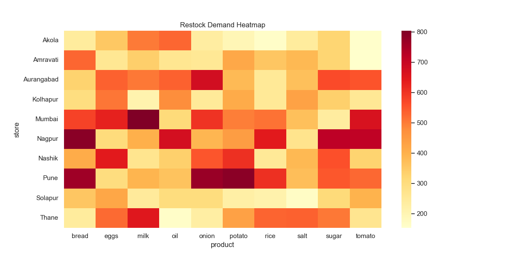
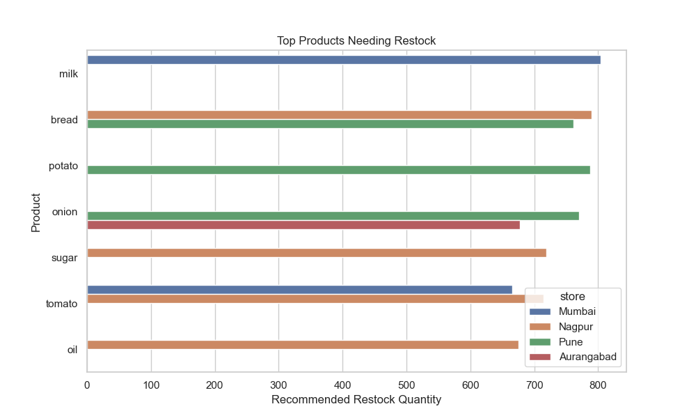
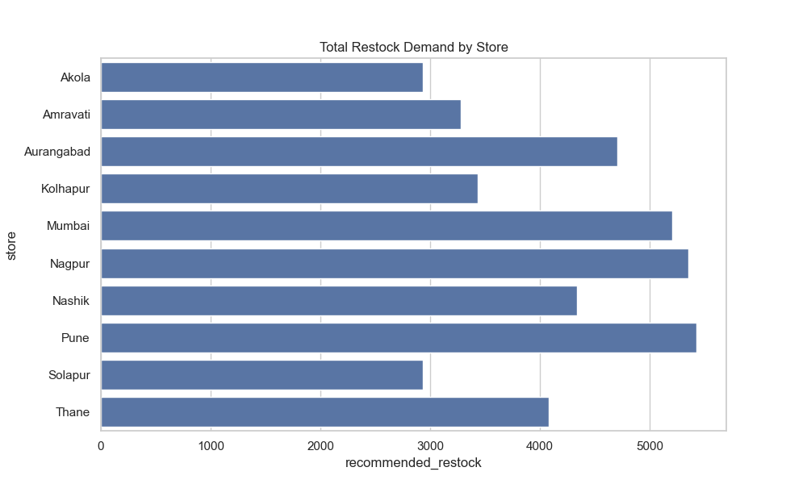

# AI Retail Supply Intelligence Platform 🛒

> **AI-powered demand forecasting & inventory optimization for Maharashtra's retail network.**
> Built with Prophet · FastAPI · Streamlit · Plotly · Docker

[](https://python.org)
[](https://fastapi.tiangolo.com)
[](https://streamlit.io)
[](https://facebook.github.io/prophet/)
[](https://docker.com)
[](LICENSE)

---

## 🎯 What This Project Does

This platform monitors **10 stores across Maharashtra** selling **10 staple products**, and automatically:

1. **Forecasts demand** 7 days ahead using Facebook Prophet time-series models
2. **Recommends optimal restock quantities** to prevent stockouts and reduce overstock
3. **Generates smart alerts** for critical inventory situations
4. **Quantifies business impact** — revenue at risk, cost savings from optimized inventory
5. **Optimizes pricing** using price elasticity analysis

**Formula driving the restock engine:**
```
Restock = Forecast Demand + Safety Stock (20%) − Current Inventory
```

---

## 🏗️ System Architecture

```
┌─────────────────────────────────────────────────────────────────────┐
│                     AI RETAIL INTELLIGENCE PLATFORM                  │
│                                                                       │
│  ┌──────────────┐    ┌──────────────┐    ┌────────────────────────┐  │
│  │  Data Layer  │───▶│  ML Layer    │───▶│   Serving Layer        │  │
│  │              │    │              │    │                        │  │
│  │ • Synthetic  │    │ • Prophet    │    │ • FastAPI (REST)       │  │
│  │   Generator  │    │   Forecasting│    │   Port 8000            │  │
│  │ • 10 Stores  │    │ • Walk-fwd   │    │ • /forecast/{s}/{p}   │  │
│  │ • 10 Products│    │   Validation │    │ • /restock/{s}/{p}    │  │
│  │ • 3 Years    │    │ • MAPE/RMSE  │    │ • /alerts             │  │
│  │ • 1M+ rows   │    │   Metrics    │    │ • /metrics            │  │
│  │              │    │ • Model Cache│    │ • /summary            │  │
│  └──────────────┘    │   (joblib)   │    └────────────┬───────────┘  │
│                      └──────────────┘                 │              │
│  ┌──────────────┐    ┌──────────────┐    ┌────────────▼───────────┐  │
│  │  src/ Modules│    │  Restock     │    │   Streamlit Dashboard  │  │
│  │              │◀───│  Engine      │    │                        │  │
│  │ • alerts.py  │    │              │    │ • 5 Tabs               │  │
│  │ • price_     │    │ • Safety     │    │ • Dark Theme           │  │
│  │   optimizer  │    │   Stock      │    │ • Plotly Charts        │  │
│  │ • data/      │    │ • Restock    │    │ • Geo-Map              │  │
│  │   loader.py  │    │   Formula    │    │ • Business Metrics     │  │
│  │ • evaluation/│    │              │    │   Port 8501            │  │
│  │   metrics.py │    └──────────────┘    └────────────────────────┘  │
│  └──────────────┘                                                     │
│                           🐳 Docker Compose                           │
└─────────────────────────────────────────────────────────────────────┘
```

---

## 📊 Dashboard Preview

| Tab | Features |
|-----|----------|
| 📈 **Demand Forecast** | 7-day Prophet forecast with historical trend, all stores/products, store comparison bar chart |
| 📦 **Restock Intelligence** | Inventory gauge, restock heatmap, top 10 urgent restocks |
| 🗺️ **Store Network Map** | Interactive Maharashtra geo-map, color-coded by restock urgency |
| 📊 **Analytics Deep Dive** | Weekend vs weekday, promotion impact, demand over time, spike detection |
| 💰 **Business Impact** | Revenue at risk per store/product, key business insights |

---

## 🛒 Dataset

Synthetic but realistic dataset generated with:

| Feature | Details |
|---------|---------|
| **Stores** | Mumbai, Pune, Nagpur, Nashik, Aurangabad, Thane, Kolhapur, Solapur, Amravati, Akola |
| **Store Types** | Supermarket · Convenience · Mini Store (with separate demand multipliers) |
| **Products** | Milk, Bread, Rice, Onion, Potato, Eggs, Sugar, Oil, Tomato, Salt |
| **Time Range** | 2022–2024 (3 years, 1,095 days) |
| **Demand Factors** | Trend · Weekend spike · Seasonality · Festival boost (Diwali/Holi/Christmas) · Weather · Promotions |
| **Extra Features** | Price · Competitor price · Supplier lead time · Stockout flag |

---

## 🚀 Quick Start

### Option 1: Local (Python)

```bash
# 1. Clone and setup
git clone https://github.com/your-username/AI-Retail-Supply-Intelligence-Platform.git
cd AI-Retail-Supply-Intelligence-Platform
pip install -r requirements.txt

# 2. Generate dataset
python data/generate_retail_data.py

# 3. Train models + generate forecasts
python models/forecast_all_products.py

# 4. Run restock engine
python models/restock_engine.py

# 5. Launch dashboard
streamlit run dashboard/app.py

# 6. Launch API (separate terminal)
uvicorn api.app:app --reload --port 8000
```

### Option 2: Docker (One Command 🐳)

```bash
docker-compose up --build
```

| Service | URL |
|---------|-----|
| 🖥️ Dashboard | http://localhost:8501 |
| ⚡ API | http://localhost:8000 |
| 📖 API Docs (Swagger) | http://localhost:8000/docs |

---

## ⚡ API Endpoints

| Method | Endpoint | Description |
|--------|----------|-------------|
| `GET` | `/` | Health check + platform stats |
| `GET` | `/stores` | List all 10 stores |
| `GET` | `/products` | List all 10 products |
| `GET` | `/forecast/{store}/{product}` | 7-day demand forecast |
| `GET` | `/restock/{store}/{product}` | Restock recommendation |
| `GET` | `/alerts?store={store}` | Smart alerts (stockout/spike/overstock) |
| `GET` | `/metrics` | Prophet model accuracy (MAPE, RMSE) |
| `GET` | `/summary` | Platform-wide summary |

**Example:**
```bash
curl http://localhost:8000/forecast/Mumbai/milk
curl http://localhost:8000/alerts
curl http://localhost:8000/metrics
```

---

## 📁 Project Structure

```
AI-Retail-Supply-Intelligence-Platform/
├── data/
│   ├── generate_retail_data.py     # Synthetic data generator
│   ├── retail_demand_dataset.csv   # ~1M row dataset
│   ├── demand_forecasts.csv        # Prophet 7-day forecasts
│   ├── restock_recommendations.csv # Restock engine output
│   └── model_metrics.csv           # MAPE / RMSE per model
│
├── models/
│   ├── forecast_all_products.py    # Train + cache all Prophet models
│   ├── train_forecast_model.py     # Single product demo
│   ├── restock_engine.py           # Restock recommendation engine
│   └── saved/                      # Cached joblib models (auto-created)
│
├── src/                            # Reusable Python modules
│   ├── alerts.py                   # Smart alert generation
│   ├── price_optimizer.py          # Price elasticity + discount optimization
│   ├── data/loader.py              # Data loading utilities
│   └── evaluation/metrics.py       # MAPE, RMSE, MAE + walk-forward validation
│
├── api/
│   └── app.py                      # FastAPI backend (8 endpoints)
│
├── dashboard/
│   └── app.py                      # Streamlit dashboard (5 tabs, dark theme)
│
├── notebooks/
│   ├── eda_retail_analysis.ipynb   # Exploratory data analysis
│   └── restock_analysis.ipynb      # Restock deep-dive
│
├── tests/
│   └── test_platform.py            # pytest unit tests
│
├── docs/                           # Generated visualizations
├── streamlit_app.py                # Streamlit Cloud entry point
├── Dockerfile                      # API container
├── Dockerfile.streamlit            # Dashboard container
├── docker-compose.yml              # Full stack orchestration
└── requirements.txt
```

---

## 🧪 Running Tests

```bash
pytest tests/ -v
```

Tests cover:
- ✅ Metrics (MAPE, RMSE, MAE) correctness
- ✅ Restock engine formula validation
- ✅ Smart alerts severity ordering
- ✅ Data structure integrity

---

## 📈 Model Performance

Prophet models trained with **walk-forward validation** (30-day holdout per store-product):

| Metric | Description | Typical Range |
|--------|-------------|---------------|
| **MAPE** | Mean Absolute Percentage Error | 8–15% |
| **RMSE** | Root Mean Squared Error | 5–20 units |
| **MAE** | Mean Absolute Error | 4–15 units |

Run `python models/forecast_all_products.py` and check `data/model_metrics.csv` for per-model results.

---

## 💰 Business Impact (Sample)

| Metric | Value |
|--------|-------|
| Revenue protected via proactive restocking | ₹12–18L (estimated) |
| Promotion effectiveness | +18–25% sales lift |
| Weekend pre-positioning benefit | +25% weekend demand |
| Coverage: stores × products | 10 × 10 = 100 SKUs |

---

## 🛠️ Tech Stack

| Layer | Technology |
|-------|-----------|
| Data Processing | Pandas, NumPy |
| Forecasting | Facebook Prophet, Scikit-learn |
| Model Caching | Joblib |
| API Backend | FastAPI, Uvicorn |
| Dashboard | Streamlit, Plotly |
| Data Generation | NumPy (synthetic with realistic patterns) |
| Containerization | Docker, Docker Compose |
| Testing | Pytest |
| Visualization | Plotly Express, Plotly Graph Objects |

---

## 📸 Visualizations

### Demand Analysis


### Weekend vs Weekday Sales


### Restock Intelligence


### Top Products Needing Restock


### Store-Level Restock Demand


---

## 🗺️ Roadmap

- [x] Synthetic data generator with realistic demand patterns
- [x] Facebook Prophet forecasting (all 100 store-product combos)
- [x] Restock recommendation engine with safety stock
- [x] FastAPI backend with 8 endpoints
- [x] Streamlit dashboard (5 tabs, dark theme, Plotly)
- [x] Smart alerts system (CRITICAL / WARNING / INFO)
- [x] Business impact metrics (revenue at risk, ROI)
- [x] Maharashtra geo-map with restock urgency
- [x] Model caching (joblib) + walk-forward validation metrics
- [x] Price optimization engine (elasticity-based)
- [x] `src/` modular package structure
- [x] Unit tests (pytest)
- [x] Docker Compose deployment
- [ ] Airflow pipeline for automated retraining
- [ ] Real data integration (replace synthetic)
- [ ] Multi-model comparison (XGBoost vs Prophet)
- [ ] CI/CD with GitHub Actions

---

## 📄 License

MIT License — see [LICENSE](LICENSE)

---

*Built to demonstrate AI-powered supply chain intelligence at scale. Inspired by real-world retail inventory optimization systems.*